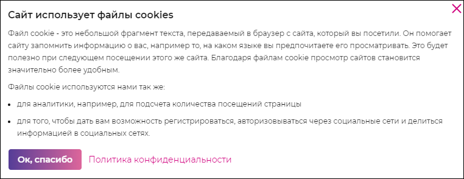

# `Cookie`
Попап с информацие по cookie. 

#### Параметры
|Параметр|Тип|Источник|Пример|Описание|
|---|---|---|---|---|
|show|`string`|`state`|`active`|Показывает/прячет попап|
|current|`string`|`state`|`all`|Краткая/подробная информация в попапе|
|onAccept|`function`|`props`|onAccept()|Функция принятия информации по cookie|
