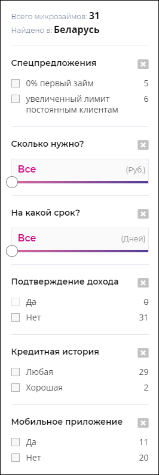
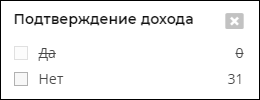
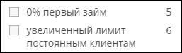
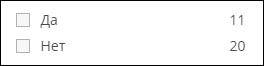

# `Filters`
Фильтры. 

#### Параметры
|Параметр|Тип|Источник|Пример|Описание|
|---|---|---|---|---|
|url|`string`|`props`|'mfo'|Раздел сайта (url страницы после `domen/`)|
|total|`number`|`props`|42|Количество найденых результатов|
|location|`string`|`props`|"Какой-то город/страна/материк/планета"|Местоположение пользователя|
|filters|`object`|`props`|{ age: [false, true, ...], ... }|Список всех фильтров и их значений|

## `Module`
Компонент фильтра. 

#### Параметры
|Параметр|Тип|Источник|Пример|Описание|
|---|---|---|---|---|
|title|`string`|`props`|"Заголовок"|Заголовок фильтра|
|children|`any`|`props`|Любые элементы|Любомы элементы вставляемые в компонент|
|isActive|`boolean`|`props`|`true/false`|Состояние активности фильтра|
|name|`string`|`props`|"filter_name"|Имя фильтра|
|onChange|`function`|`props`|onChange(`name`, `null`)|Сброс фильтра `name` на значение `null`|

## `Checkbox`
Фильтр типа checkbox. 

#### Параметры
|Параметр|Тип|Источник|Пример|Описание|
|---|---|---|---|---|
|items|`array`|`props`|['checkbox1', 'checkbox2', ...]|Список подписей значений фильтра|
|value|`array`|`props`|[`true`, `false`, ...]|Список значений фильтра|
|actual|`array`|`props`|[12, 36, ...]|Список количества результатов по каждому фильтру|
|name|`string`|`props`|"filter_one"|Имя фильтра|
|onChange|`function`|`props`|onChange(`name`, `value`)|Функция изменения значения фильтра `name` на новое `value`|

## `Radio`
Фильтр типа radio. 

#### Параметры
|Параметр|Тип|Источник|Пример|Описание|
|---|---|---|---|---|
|items|`array`|`props`|['checkbox1', 'checkbox2', ...]|Список подписей значений фильтра|
|value|`array`|`props`|[`true`, `false`, ...]|Список значений фильтра|
|actual|`array`|`props`|[12, 36, ...]|Список количества результатов по каждому фильтру|
|name|`string`|`props`|"filter_one"|Имя фильтра|
|onChange|`function`|`props`|onChange(`name`, `value`)|Функция изменения значения фильтра `name` на новое `value`|
