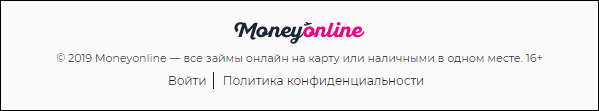

# `Footer`
Футер сайта. 

#### Параметры
|Параметр|Тип|Источник|Пример|Описание|
|---|---|---|---|---|
|isLoggedIn|`boolean`|`props`|`true/false`|Состояние авторизации|
|onLogin|`function`|`props`|onLogin(`isLoggedIn`)|Функция вызова попапа авторизации или логаута, в зависимости от значения `isLoggedIn`|
