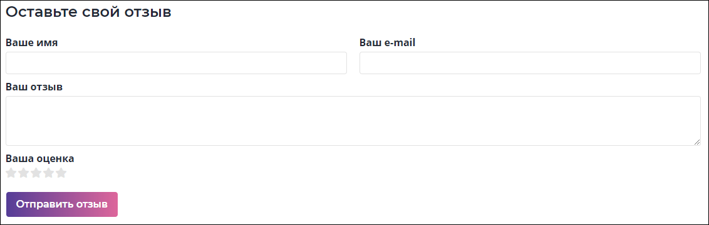

# `Leave testi`
Форма отправки отзывов. 

#### Параметры
|Параметр|Тип|Источник|Пример|Описание|
|---|---|---|---|---|
|id|`string`|`props`|"5"|ID партнера для которого оставляется отзыв|
|onSubmit|`function`|`props`|onSubmit({partner: `id`, `name`, `email`, `text`, `rating`})|Функция отправки отзыва. Передаются следующие значения: <ul><li>`id` - ID партнера</li><li>`name` - имя пользователя оставляющего свой отзыв</li><li>`email` - email пользователя</li><li>`text` - текст отзыва</li><li>`rating` - рейтинг от 1 до 5</li></ul>|
|name|`string`|`state`|"Имя"|Имя пользователя|
|email|`string`|`state`|"email@email.com"|E-mail пользователя|
|text|`string`|`state`|"Текст"|Текст отзыва|
|rating|`string`|`state`|"4"|Рейтинг для партнера|
|isEditing|`object`|`state`|{name: false, email: false, text: false, rating: flase}|Проверка полей на заполненность|
