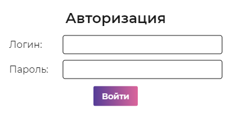
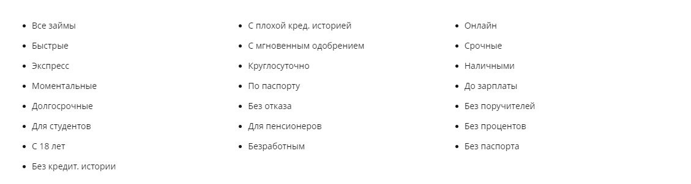
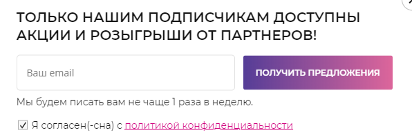
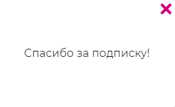
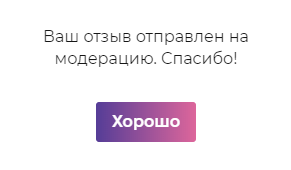

# `Popups`
Попапы проекта. 

## `Auth`
Попап авторизации. 

#### Параметры
|Параметр|Тип|Источник|Пример|Описание|
|---|---|---|---|---|
|error|`boolean'|`props`|`true/false`|Параметр ошибки|
|login|`string`|`state`|"login123"|Логин для авторизации|
|pass|`string`|`state`|"pass123"|Пароль для авторизации|
|onSubmit|`function`|`props`|onSubmit(`login`, `pass`)|Функция авторизации, передает `login` и `pass`|

## `Categories`
Попап с категориями. 

#### Параметры
|Параметр|Тип|Источник|Пример|Описание|
|---|---|---|---|---|
|value|`array`|`props`|[true, false, false, ...]|Список значений категорий|
|categories|`array`|`props`|[{...}, ...]|Список категорий; каждый элемент содержит: <ul><li>`text` - заголовок категории тип - `string`</li><li>`dataID` - ID категории тип - `string`</li><li>`index` - порядковый номер категории тип - `number`</li></ul>|
|onChange|`function`|`props`|onChange(`value`, `id`)|Функция изменения отслеживаемой категории, передается `value` и `id`|

## `Email`
Попап подписки на email рассылку. 

#### Параметры
|Параметр|Тип|Источник|Пример|Описание|
|---|---|---|---|---|
|email|`string`|`state`|"email123@gmail.com"|Email пользователя|
|onSubmit|`function`|`props`|onSubmit(`email`)|Функция подписки на рассылку, передает `email` введенный пользователем|
|onClose|`function`|`props`|onClose()|Функция закрытия попапа|

## `Popup`
Компонент-врапер. 

#### Параметры
|Параметр|Тип|Источник|Пример|Описание|
|---|---|---|---|---|
|isOpened|`boolean`|`props`|`true/false`|Показывает/скрывает попап|
|name|`string`|`props`|"email"|Имя попапа|
|children|`any`|`props`|anything|Внутренние элементы попапа|

## `Subscribed`
Попап подтверждения подписки на email рассылку. 

#### Параметры
|Параметр|Тип|Источник|Пример|Описание|
|---|---|---|---|---|
|onClose|`function`|`props`|onClose|Функция закрытия попапа|

## `Testimonials`
Попап подтверждения отправки отзыва. 

#### Параметры
|Параметр|Тип|Источник|Пример|Описание|
|---|---|---|---|---|
|onClose|`function`|`props`|onClose|Функция закрытия попапа|
