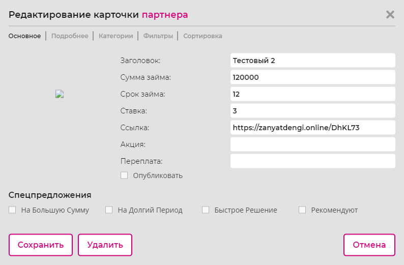
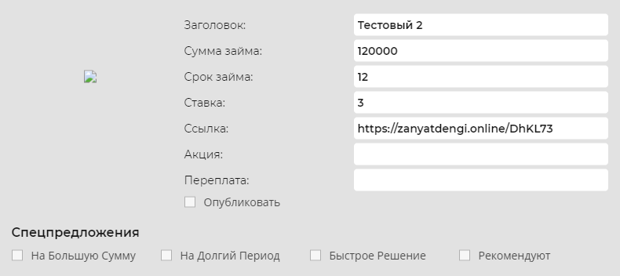
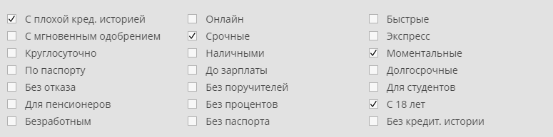
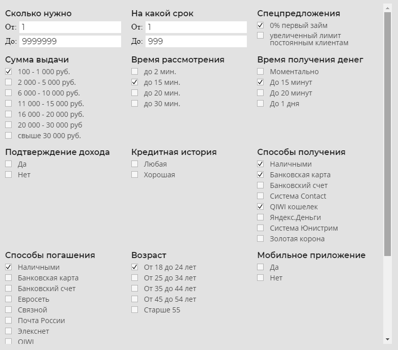

# `Edit`
Попап редактирования карточки партнера. 

#### Параметры
|Параметр|Тип|Источник|Пример|Описание|
|---|---|---|---|---|
|partner|`object`|`props`|{id:..., ...}|Данные партнера|
|tab|`string`|`state`|"main"|Показывает выбранную вкладку|
|onSave|`function`|`props`|onSave(`id`, `partner`)|Функция сохранения информации по партнеру, передается `id` партнера и его данные `partner`|
|onDelete|`function`|`props`|onDelete(`id`)|Функция удаления партнера, передается `id` партнера|
|onCancel|`function`|`props`|onCancel()|Функция отмены изменений|
|onClose|`function`|`props`|onClose()|Функция закрытия попапа|

## `Main`
Закладка попапа редактирования с общей информацией по партнеру. 

#### Параметры
|Параметр|Тип|Источник|Пример|Описание|
|---|---|---|---|---|
|names|`object`|`props`|{name: "title", ...}|Список заголовков параметров|
|main|`object`|`props`|{title: "...", ...}|Параметры партнера|
|onChange|`function`|`props`|onChange("main", `name`, `value`)|Функция изменения значений параметров раздела `main`|

## `Details`
Закладка попапа редактирования с подробной информацией по партнеру. 

#### Параметры
|Параметр|Тип|Источник|Пример|Описание|
|---|---|---|---|---|
|details|`object`|`props`|{age: "...", ...}|Подробная информация партнера|
|onChange|`function`|`props`|onChange("details", `name`, `value`)|Функция изменения значений параметров раздела `details`|

## `Categories`
Закладка попапа редактирования с выбором категорий к которым относится попап. 

#### Параметры
|Параметр|Тип|Источник|Пример|Описание|
|---|---|---|---|---|
|type|`string`|`props`|"mfo"|Тип категорий|
|values|`array`|`props`|[true, false, false, ...]|Список значений, соответствующие категориям|
|onChange|`function`|`props`|onChange("filters", `name`, `value`)|Функция изменения значений параметров раздела `filters`|

## `Filters`
Закладка попапа редактирования с параметрами фильтра для партнера. 

#### Параметры
|Параметр|Тип|Источник|Пример|Описание|
|---|---|---|---|---|
|
