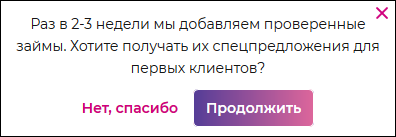

# `Push notification`
Попап пуш уведомлений. 

#### Параметры
|Параметр|Тип|Источник|Пример|Описание|
|---|---|---|---|---|
|isOpen|`boolean`|`props`|`true/false`|Показывает/скрывает попап|
|onAccept|`function`|`props`|onAccept|Функция согласия на отправку пуш уведомлений|
|onDecline|`function`|`props`|onDecline|Функция отказа от отправки пуш уведомлений|
