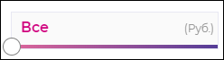

# `Range input`
Инпут с диапазоном. 

#### Параметры
|Параметр|Тип|Источник|Пример|Описание|
|---|---|---|---|---|
|name|`string`|`props`|"range_name"|Имя фильтра|
|label|`string`|`props`|"Пометка"|Пометка для инпута (`optional`)|
|start|`string`|`props`|"100"|Начальное значение диапазона|
|end|`string`|`props`|"1000000"|Конечное значение диапазона|
|step|`string`|`props`|"1000"|Шаг изменения значения|
|eStep|`boolean`|`props`|`true/false`|Включает/выключает экспоненциальный шаг изменения значения|
|position|`string`|`state`|"0"|Текущее положение ползунка|
|value|`string`|`state`|"11200"|Текущее значение фильтра|
|isMoving|`boolean`|`state`|`true/false`|Отслеживает состояние ползунка на текущий момент (передвигается или нет)|
