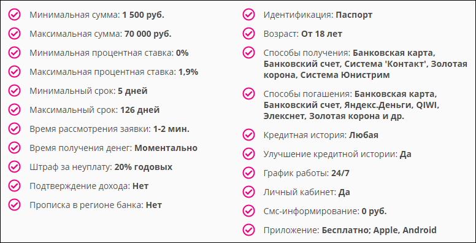
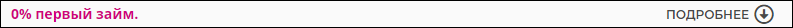

# `Results`
Компонент вывода партнеров. 

#### Параметры
|Параметр|Тип|Источник|Пример|Описание|
|---|---|---|---|---|
|isLoggedIn|`boolean`|`props`|`true/false`|Показывает состояние авторизации|
|isFetching|`boolean`|`props`|`true/false`|Показывает состояние загрузки партнеров|
|partners|`array`|`props`|[{...}, ...]|Список партнеров|
|hasMore|`boolean`|`props`|`true/false`|Показывает остались ли еще карточки для подгрузки|
|onScroll|`function`|`props`|onScroll()|Функция подгрузки следующих 8-ми партнеров|

## `Card`
Карточка партнера. 

#### Параметры
|Параметр|Тип|Источник|Пример|Описание|
|---|---|---|---|---|
|item|`object`|`props`|{main: {...}, details: {...}, ...}|Данные по партнеру|
|tail|`string`|`props`|"tail_param=dfglkg-sdf-ssffqw"|Хвост для ссылки на партнера|
|edit|`boolean`|`props`|`true/false`|Показывает/скрывает кнопку редактирования карточки партнера|
|dataID|`string`|`props`|"15"|ID карточки партнера|
|onMore|`function`|`props`|onMore(`id`, `title`)|Функция отслеживания кликов пользователя, передается `id` и `title` карточки партнера|
|onEdit|`function`|`props`|onEdit(`id`)|Функция открытия попапа редактирования карточки партнера, передается `id` карточки|
|onOrder|`function`|`props`|onOrder(`id`, `title`, `source`)|Функция отслеживания кликов пользователя, передается `id`, `title` и `source` (элемент на который кликнули) карточки партнера|

## `Details`
Подробная информация партнера. 

#### Параметры
|Параметр|Тип|Источник|Пример|Описание|
|---|---|---|---|---|
|details|`object`|`props`|{minSumm: ..., ...}|Подробная информация карточки партнера|

## `Info`
Футер карточки партнера, открывает/закрывает подробную информацию. 

#### Параметры
|Параметр|Тип|Источник|Пример|Описание|
|---|---|---|---|---|
|main|`object`|`props`|{firstLoan: ..., ...}|Общая информация карточки партнера|
|isOpen|`boolean`|`state`|`true/false`|Показывает состояние (открыто/закрыто) подробной информации|
|onOpen|`function`|`props`|onOpen()|Открывает/закрывает подробную информацию|
