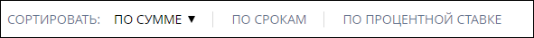

# `Sorting`
Компонент сортировки карточек партнеров. 

#### Параметры
|Параметр|Тип|Источник|Пример|Описание|
|---|---|---|---|---|
|sortInfo|`object`|`props`|{sortBy: ..., ...}|Информация по сортировке. Содержит следующие параметры: <ul><li>`sortBy` - параметр по которому идет сортировка тип - `string`</li><li>`isAscending` - направление сортировки (по убыванию/возростанию) тип - `boolean`</li><li>`isSorted` - состояние сортировки (была ли выполнена сортировка) тип - `boolean`</li></ul>|
|sortButtons|`array`|`props`|[{title: ..., id: ...}, ...]|Список кнопок сортировки Каждый элемент содержит: <ul><li>`title` - подпись параметра сортировки</li><li>`id` - имя параметра сортировки</li></ul>|
|onClick()|`function`|`props`|onClick(`name`)|Функция сортировки, передается имя (`name`) параметра сортировки|
