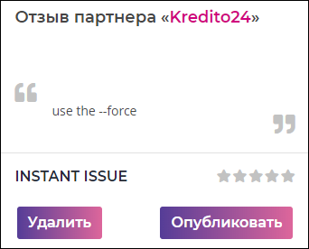

# `Testi moderate`
Отзыв пользователя еще не прошедший модерацию. 

#### Параметры
|Параметр|Тип|Источник|Пример|Описание|
|---|---|---|---|---|
|item|`object`|`props`|{id: ..., ...}|Параметры отзыва|
|title|`string`|`props`|"Заголовок"|Заголовок партнера|
|text|`string`|`props`|"Текст"|Текст отзыва|
|user|`string`|`props`|"Анна"|Имя пользователя оставившего отзыв|
|rating|`string`|`props`|"3"|Числовое значение рейтинга|
|isLoggedIn|`boolean`|`props`|`true/false`|Показывает состояние авторизации|
|onDelete|`function`|`props`|onDelete(`id`)|Функция удаления отзыва, передается `id` отзыва|
|onPublic|`function`|`props`|onPublic({`item`, text: `editText`, status: 'published'})|Функция публикации отзыва, передается параметры отзыва `item`, отредактированный текст `editText` (если он редактировался), и изменяется status с `created` на `published`|
|isEdit|`boolean`|`state`|`true/false`|Показывает состояние редактирования текста отзыва|
