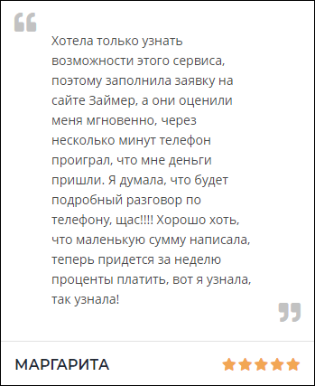

# `Testi`
Отзыв пользователя прошедший модерацию. 

#### Параметры
|Параметр|Тип|Источник|Пример|Описание|
|---|---|---|---|---|
|text|`string`|`props`|"Текст"|Текст отзыва|
|user|`string`|`props`|"Анна"|Имя пользователя оставившего отзыв|
|rating|`string`|`props`|"3"|Числовое значение рейтинга|
|isLoggedIn|`boolean`|`props`|`true/false`|Показывает состояние авторизации|
|testiID|`string`|`props`|"32"|ID отзыва|
|onDelete|`function`|`props`|onDelete(`id`)|Функция удаления отзыва, передается `id` отзыва|
