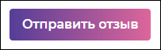

# `Filters`
Вспомогательные компоненты. 

## `Button`
Компонент кнопки. 

#### Параметры
|Параметр|Тип|Источник|Пример|Описание|
|---|---|---|---|---|
|type|`string`|`props`|"normal"|Тип кнопки, отвечает за внешний вид; по умолчанию - `normal`; возможные значения: `normal`; `optional`|
|class|`string`|`props`|"style.additional"|Дополнительный класс, если необходимо поправить стили в определенном месте (`optional`)|
|children|`any`|`props`|-|Любые элементы внутри кнопки|
|id|`string`|`props`|"anyID"|ID кнопки|
|onClick|`function`|`props`|onClick(`id`)|Функция клика на кнопку, передает `id` кнопки|
